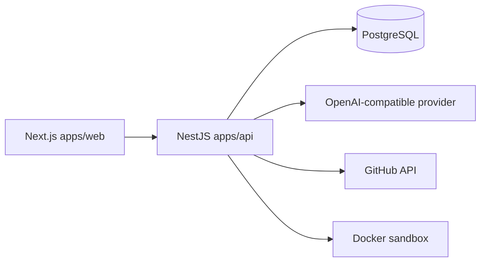
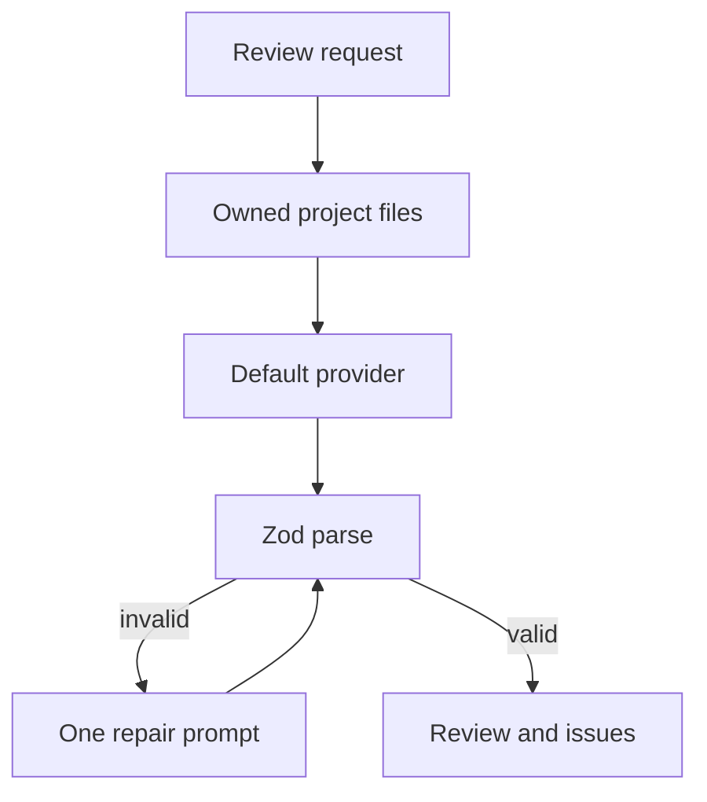
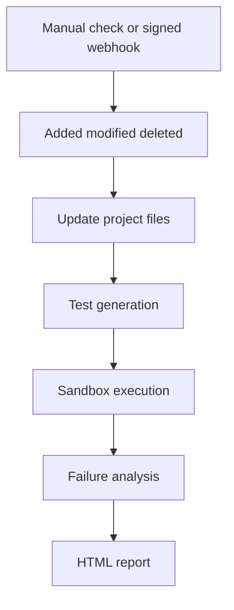

# Architecture

Strix is an npm workspace. The browser talks to Next.js. Next.js proxies `/api` to NestJS. NestJS owns authentication, persistence, provider calls, GitHub access, and the Docker sandbox.

## Applications

`apps/web` is the App Router UI. Routes that need a session are gated in `src/proxy.ts`. The session cookie is `strix_session` (httpOnly, SameSite=Lax). Pages load their own data with the shared client in `src/lib/api.ts`.

`apps/api` is NestJS with Prisma. Controllers validate input and check `request.user.id`. A missing or foreign project returns 404. The global exception filter hides stack traces outside development. API keys are encrypted before they are stored. Logs pass through a redactor so keys and bearer tokens are not written out.

`sandbox` is a Node 24 Alpine image. The entrypoint copies the mounted input into a writable workspace and runs `node --test` on the generated files. The API starts that image with no network, a read-only root, dropped capabilities, a non-root user, memory and CPU caps, a pid limit, and an environment that contains only `HOME` and `NODE_ENV`.

`e2e` is Playwright. `docker-compose.yml` runs PostgreSQL only.

## Data

P0 and the follow-on chat tables live in `apps/api/prisma/schema.prisma`: `User`, `Project`, `ProjectFile`, `Review`, `ReviewIssue`, `AiProvider`, `GithubRepository`, `GeneratedTest`, `TestRun`, `TestResult`, `Report`, `ChatSession`, and `ChatMessage`. Deleting a project cascades to its files, reviews, repository link, test runs, and reports. `User.fallbackProviderId` points at the optional fallback provider.

## Review flow

Reviews ask for `summary`, `issues[]` (title, severity, file, line, description, recommendation, confidence), and `recommendations[]`. Issues whose file path is not in the project are dropped. If the JSON is still invalid after one repair, the request fails with a controlled error. Modes are security, performance, and quality.

Test generation and failure analysis use the same provider registry and the same repair step. Chat uses the same provider and a keyword retrieval pass: up to six files, with a character budget, scored against the question.

If the default provider throws and the user has a fallback, the call is repeated once on the fallback and the response is marked as fallback.

The mock provider answers only when `AI_ALLOW_MOCK=true` and `NODE_ENV` is not `production`. It exists so tests can run without a live model.

## GitHub and the shared pipeline

Public `https://github.com/owner/repo` URLs are accepted. The connect step downloads the repository archive, stores text files, and records the branch SHA. A later check compares that SHA with the current head. Added and modified files are sent to test generation. The generated tests and the project source are executed in the sandbox. Deletions with nothing left to test record an empty passing run. Continuous testing can be turned off; the check still updates files and the SHA.

`GITHUB_USE_FIXTURES=true` serves an in-memory archive and two fixed SHAs so the check can be exercised without GitHub. The webhook route verifies `X-Hub-Signature-256` against `GITHUB_WEBHOOK_SECRET` and then calls the same pipeline.

ZIP upload uses the same file store. Paths are rejected when they escape the archive. `node_modules`, `.git`, build output, and binary files are skipped. A single wrapper directory is removed only when the archive still has a nested tree underneath it, which matches a GitHub zipball without flattening a `src/` folder that is the real root.

## Reports

Each completed run can produce one HTML document. CSS is inline. Text is escaped. The file does not load remote scripts or styles. Failure analysis in the report is labeled as generated.
